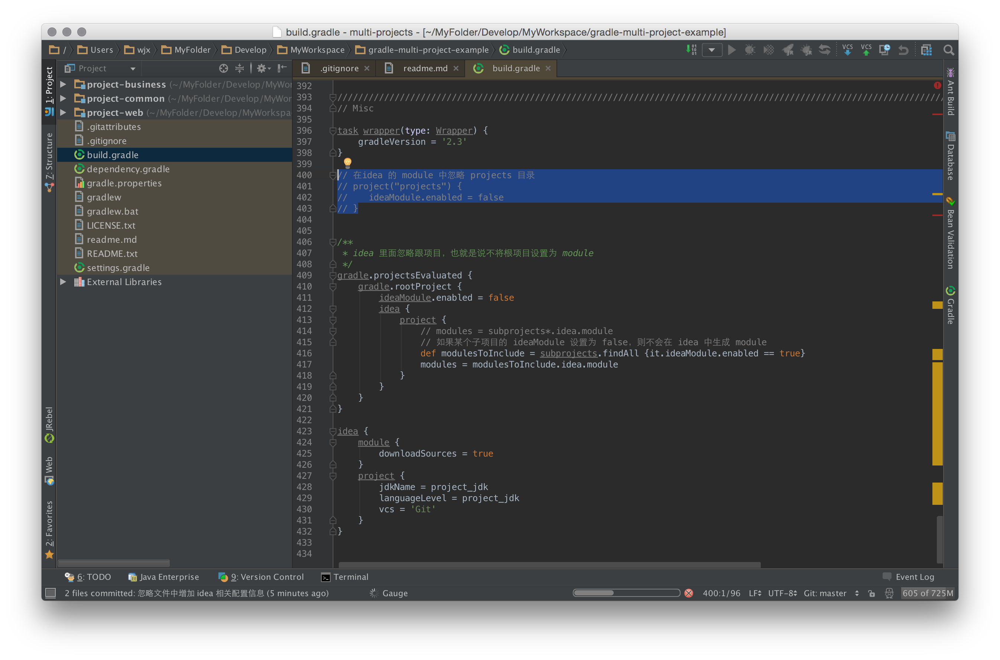

# Gradle 多项目管理示例

这个项目用于学习研究 Gradle 的一个测试用例，扔掉也可惜，所以修改了一下放在这儿，如果能对别人有所帮助的话也算是好事一件。

## 为什么用 Gradle

主要还是审美需求。

之前一直用 Ant 来写很多 task 做项目管理，配合 ivy 做依赖管理，不过当项目增多之后这玩意开始力不从心了，多项目采用 Ant 来搞的话有点自虐。

本来打算用 Maven 的，功能确实很强，不过它的依赖管理的写法一直让我有点犯恶心，ivy里面一行语句，丫得三行，看着蛮屏幕的 xml 标签绝对不是什么很愉快的经历。对这东西我这几年基本上是几用几抛。

于是只有 Gradle 这个选择了。

## 主要需求

上面说了，采用这东西其实最主要的还是做**多项目管理**和**jar包依赖管理**，显然这工具在这两方面做的还不赖。

至于其它的一些修改、删除之类的小活就按需添加吧。

## 目录结构说明

### 顶级目录

放置了一堆 Gradle 的配置文件以及 wrapper 等，为了审美的需要，没把各个子项目放置到这个目录下，专门开辟了个 projects 目录用来存放所有项目。

> 新版本中取消了 projects 目录，将子项目都提升到了根下，当然，原来的配置方式也可以。

### projects 目录

实际项目存放的地点。

> 可选项，也可以直接将所有子项目放在根目录下，这也是推荐用法。

每个项目都包含了两个子目录：doc、source，前者用来放置文档，后者为源码。

这些项目也可能是来自不同的仓库，例如 git、subversion 等，不同的项目组可能会下载不同的项目于依赖模块，这时候只需要配置一下顶级目录中的 settings.gradle，管理好 include 即可。

## Idea IDE 支持

增加了 Idea 支持，子项目为 Idea 中的 module。并且可以在 module 中忽略某些子项目，例如根项目、projects 等。

## 内置插件

### Gradle 自带插件

- 所有子项目
	- **eclipse**： 用于生成 eclipse 配置
	- **Idea**: 支持 Idea 直接打开项目
	- **java**
- Web 子项目（新增 Task）

	> 打 war 包的时候版本号做了一些处理，增加了编译数字，例如：project-web.1.1.0.1234.war.

	- **snapshot**： 用于打 war 包，注意：这儿做了一些处理，war默认打的包带有 SNAPSHOT 后缀
	- **release**: 如果想打发布版的 war 包，可采用 gradle release，打开 project-web 的 build.gradle 看看就知道怎么回事了

----------

## 一些小技巧

### jar 包定义外移

这个是在查找某个问题的时候在一个国外网站（具体哪个忘记了，查的太多也找不到了）发现的。就是将所有的 jar 的定义放置到了 dependencyDefinitions.gradle 中，然后在顶级目录的 build.gradle 中引入：

> apply from: 'dependencyDefinitions.gradle'

该文件内容为：
<pre>
 ext.versions = [
     spring: '3.2.5.RELEASE',
     security: '3.1.4.RELEASE',
     jackson: '1.9.13',
     logback: '1.0.13',
     slf4j: '1.7.5',
     httpclient: '4.3.1',
 ]

ext.libraries = [
	"servlet-api": "javax.servlet:servlet-api:2.5",
	"jsp-api": "javax.servlet:jsp-api:2.0",

	"ebean": "org.avaje.ebeanorm:avaje-ebeanorm:3.2.4",
	"persistence-api": "javax.persistence:persistence-api:1.0",

	"aspectjweaver": "org.aspectj:aspectjweaver:1.7.4",
	...
]
</pre>

在各个子项目的 build.gradle 中就只需要写 libraries.'ebean' 即可，而不需要把这些jar 散落的到处都是。

将来升级的时候也方便。

### 善用 gradle dependencies

这个命令可以很方便地检查 jar 的依赖情况，显示的是简单的树形结构，因为在命令行下会显示太多行，所以可以将其输出到一个文本中再看：
> gradle dependencies > depend.log

通过这个命令我极大简化了我的 ext.libraries 定义，那些自动会依赖的 jar 包就不需要再写了。

### java 编译时候报编码错误

这是个经典的问题，当然，用了IDE 之后已经见不到此问题，所以在 gradle 编译的时候再次发现此问题的时候都有点故人复见的感觉了。

想当年初学 java 的时候采用命令行编译的诸位应该都会有这个感觉吧。

解决办法很简单，增加一行设置即可：
> [compileJava, compileTestJava]\*.options*.encoding = 'UTF-8'

### 不要定义 group，除非你知道自己在做什么

好吧，其实我到现在还不大清楚 group 的意思是啥，之前我以为跟 "group 'org.avaje.ebeanorm' module: 'avaje-ebeanorm'" 的 group 一样，于是就在 build.gradle 中定义 group someok.common

结果在项目编译的时候遇到大量错误，经过艰苦的 debug （可以试试 --debug 就知道为什么说艰苦了）和 dependencies 检测才发现问题可能出在了 group 定义上了，删掉后一切方才圆满。

### 忽略掉 .gradle 目录

在顶级目录下有个 .gradle 文件夹，这个是 gradle 自动生成的，可以在 git 的 .gitignore 文件中增加一条忽略掉：
> .gradle/

### Maven 库中没有的 jar 该怎么管理？

这种情况不多见，但绝对存在。

我的办法是在顶级目录增加一个 libs 文件夹，这个文件夹里面的 jar 是对所有项目都起作用的。

如果是某个项目自用的，则可以在该项目的 source 下面创建个 libs，具体实现是在顶级目录下的 build.gradle 中：
<pre>
ext.jarTree = fileTree(dir: 'libs', include: '**/*.jar')
ext.rootProjectLibs = new File(rootProject.rootDir, 'libs').getAbsolutePath()
ext.jarTree += fileTree(dir: rootProjectLibs, include: '**/*.jar')

compile jarTree
</pre>

### 开发环境、生产环境设置

Gradle 有几种办法可以用来管理这些设置，例如将配置文件按环境写在 build 文件的不同块中。

不过我的办法是分目录：

- resources： 通用配置放在这儿
- resources-dev： 开发环境配置
- resources-prod： 生产环境配置

在用 gradle eclipse 命令生成 IDE 配置的时候，会默认将前两个目录包含在 eclipse 中，只有通过 gradle release 生成 war 包的时候才会忽略 dev，使用 prod。

### 打包命令

上面已经说过，打 war 包时候有两种方式：

- gradle war： 这个是用来打测试的 war 包，文件后缀增加 **SNAPSHOT**，采用的是 resources-dev。
- gradle release： 这个才是用来打生产用的 war 包，采用的是 resources-prod。

这是我个人喜好的用法，当然也可以按照自己的喜好来处理了。# -gradle-multi-project-example
